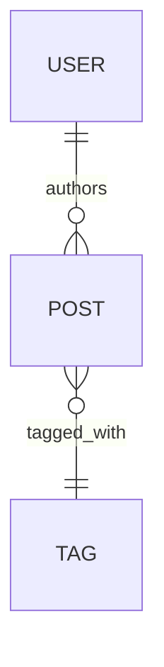

# Architecture — {{PROJECT_NAME}}

> Source of truth for system shape, stack decisions, data model, and cross-cutting concerns. Read before triaging architecturally-loaded specs. Append to the Trade-off log when material decisions change.

**Last updated:** {{DATE}}
**Status:** {{Greenfield | Living | Frozen for V1}}

---

## 0. Context

One paragraph linking to `docs/PRD.md`. Why this product exists, who it's for, what V1 must do. This is for orientation only — don't duplicate the PRD here.

---

## 1. Stack

| Layer | Choice | Notes |
|---|---|---|
| Language / runtime | | |
| Framework | | |
| Hosting / deploy | | |
| Database | | |
| ORM / query layer | | |
| Auth | | |
| Payments / billing | | |
| Storage / files | | |
| Email / notifications | | |
| Background jobs / queues | | |
| Search | | |
| Observability | | |
| Testing | | |

Each row should name the *specific* product/library and a one-line note on the integration shape. "TBD" rows must have a corresponding Trade-off log entry with revisit deadline.

---

## 2. Data model

### Entities

For each persisted entity, list purpose + key fields.

| Entity | Purpose | Key fields |
|---|---|---|
| | | |

### Relationships

### Conventions

- **Identity strategy:** {{UUIDv7 | nanoid | bigint}}
- **Multi-tenancy model:** {{none | row-level (tenant_id) | schema-per-tenant}}
- **Soft-delete policy:** {{global on | per-entity (list) | hard-delete only}}
- **Audit / history:** {{none | event log | per-entity history table}}
- **Time fields:** {{created_at, updated_at, deleted_at — `timestamptz` UTC}}

---

## 3. Service shape

- **Topology:** {{monolith | modular monolith | services}}
- **Modules** (if modular):

| Module | Owns | Exposes | Callers |
|---|---|---|---|
| | | | |

- **API style:** {{REST | RPC | GraphQL | server actions | mix}}
- **API conventions:**
  - Resource naming: {{plural-noun, kebab-case, etc.}}
  - Error envelope: {{shape}}
  - Pagination: {{cursor | offset | none}}
  - Idempotency: {{header? key? not required for V1}}
  - Versioning: {{none | URL-prefixed | header-based}}
- **Public vs admin vs internal split:** describe the auth boundary at each.

---

## 4. Cross-cutting concerns

### Auth & authorization
- Role model: {{none | simple roles | RBAC | ABAC}}
- Where checks live: {{middleware | route handlers | query layer}}
- Session model: {{cookie | JWT | both}}

### Error handling
- Error class taxonomy: {{validation, auth, not-found, conflict, server}}
- Surface format: {{JSON envelope shape}}

### Logging / observability
- Logger: {{Pino | console | vendor}}
- What's logged: {{requests, errors, key business events}}
- PII handling: {{redaction strategy}}
- Tracing: {{none | OpenTelemetry | vendor}}

### Caching
- Layers: {{none | runtime cache | CDN | both}}
- Strategy: {{TTL | tag-based | manual}}
- Invalidation: {{describe rules}}

### Rate limiting
- Where: {{middleware | per-route | none for V1}}
- Backend: {{in-memory | Redis | edge}}

### Secrets
- Storage: {{Vercel env | secret manager | both}}
- Rotation: {{cadence}}

### Background work
- Where: {{cron | queue | none for V1}}
- Failure handling: {{retry / DLQ}}

### Testing
- Unit: {{framework}}
- Integration: {{framework, what's real vs mocked}}
- E2E: {{Playwright | Cypress | none for V1}}
- Database in tests: {{real (preferred) | mocked}}

### Migration & deploy
- Schema changes: {{forward-only | expand-contract | dual-write}}
- Rollback story: {{describe}}

---

## 5. Evolution

### Reversibility map

| Decision | Reverse cost |
|---|---|
| | easy / medium / hard |

### Bets we're making

- Bet: {{specific, falsifiable}}
- Trigger to revisit: {{measurable threshold}}

### Deferred decisions

| Decision | Revisit deadline | Owner |
|---|---|---|
| | {{phase boundary or date}} | |

### Known wrong choices we're shipping anyway

Anti-pattern but honest. Document it.

---

## 6. Trade-off log

Append-only. Newest at the top.

### {{YYYY-MM-DD}} — {{decision title}}
- **Chose:** {{option}}
- **Considered:** {{alternative(s)}}
- **Reason:** {{why}}
- **Reversibility:** {{easy/medium/hard}}
- **Related:** {{spec ID, PR, or link}}
