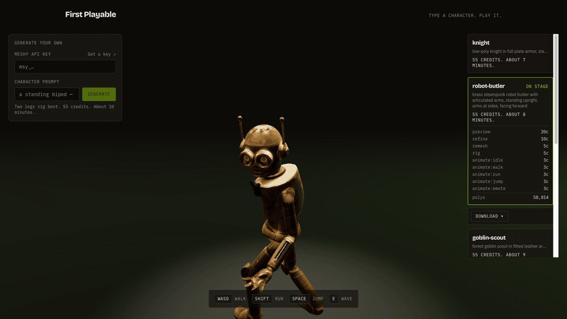
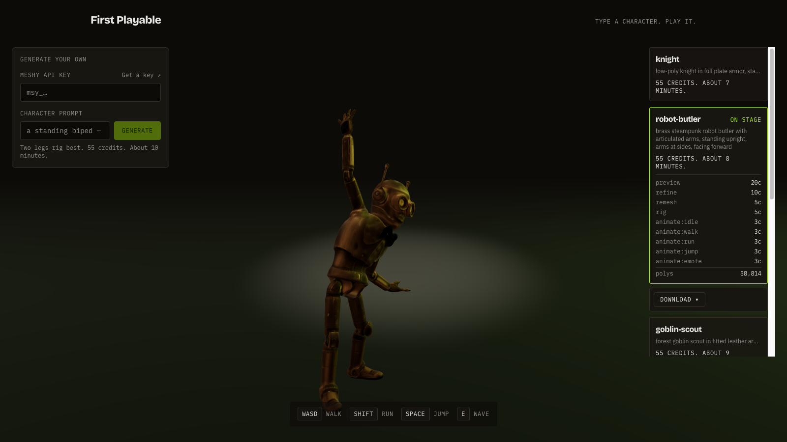

# Prompt to Playable

**Type a character. Play it.**



**[▶ Play it live](https://prompt-to-playable.vercel.app)** — no key, no signup. You're driving a character in about 15 seconds.

A browser demo that turns a text prompt into a playable game character with the [Meshy API](https://www.meshy.ai): text-to-3D preview → PBR texture refine → remesh → auto-rig → five animation clips — then the character drops into a third-person playground. Every stage shows the real API call that made it happen.

Bring your own Meshy key and it generates *your* character. 55 credits. About 6 minutes. The wait is the show: the pipeline rail streams progress, credits, and copyable `curl` for each stage.

MIT licensed. Built with Next.js, React Three Fiber, and the Meshy API.

## Quickstart (60 seconds)

```bash
git clone https://github.com/serafinsanchez/prompt-to-playable.git
cd prompt-to-playable
npm install
npm run dev
```

Open http://localhost:3000. The pre-generated gallery works with no key at all.

To exercise the generation flow without spending credits, use Meshy's test-mode key in the key field:

```
msy_dummy_api_key_for_test_mode_12345678
```

It returns canned task responses and costs 0 credits. For real generation, get a key at [meshy.ai](https://www.meshy.ai) — the demo's key field sends it per-request from your browser session; the server never stores it.

## How the pipeline works

Five stages, chained by task id — each stage's output feeds the next as `preview_task_id` / `input_task_id` / `rig_task_id`. No downloading and re-uploading between stages. Text to 3D is the **v2** API; remesh, rigging, and animations are **v1**.

| # | Stage | Endpoint | Key parameters | Credits |
|---|-------|----------|----------------|---------|
| 1 | Preview mesh | `POST /openapi/v2/text-to-3d` | `mode: "preview"`, `pose_mode: "a-pose"`, `topology: "quad"`, `ai_model: "meshy-6"`, `should_remesh: true`, `target_polycount: 30000` | 20 |
| 2 | PBR texture | `POST /openapi/v2/text-to-3d` | `mode: "refine"`, `preview_task_id`, `enable_pbr: true`, `texture_resolution: "4k"`, `remove_lighting: true` | 10 |
| 3 | Remesh | `POST /openapi/v1/remesh` | `input_task_id`, `topology: "quad"`, `target_polycount: 30000` | 5 |
| 4 | Auto-rig | `POST /openapi/v1/rigging` | `input_task_id`, `height_meters: 1.7` | 5 |
| 5 | Animate ×5 | `POST /openapi/v1/animations` | `rig_task_id`, `action_id` (idle, walk, run, jump, emote — a wave) | 3 each |

**55 credits total.** Failed tasks auto-refund. Each stage is a task you poll until `SUCCEEDED`, then hand its id to the next stage.

The first stage's request, exactly as the demo sends it:

```bash
curl -X POST https://api.meshy.ai/openapi/v2/text-to-3d \
  -H "Authorization: Bearer $MESHY_API_KEY" \
  -H "Content-Type: application/json" \
  -d '{
    "mode": "preview",
    "prompt": "a bronze knight with a tower shield",
    "pose_mode": "a-pose",
    "topology": "quad",
    "ai_model": "meshy-6",
    "should_remesh": true,
    "target_polycount": 30000
  }'
```

Every request/response the demo makes is visible in the UI — the API panel next to each stage shows the live call with a copyable `curl` (key masked, always). The source of truth for those panels is [`components/pipeline/api-descriptor.ts`](components/pipeline/api-descriptor.ts), which derives each request from the typed client in [`lib/meshy/client.ts`](lib/meshy/client.ts) and is sync-tested against it — the docs can't drift from the code.



## A few implementation notes

- **The key never touches the server.** Your Meshy key lives in browser `sessionStorage` and rides each request as a header through a dumb passthrough proxy (`app/api/meshy/[...path]`) that mirrors Meshy's real REST paths. No accounts, no database, nothing server-held.
- **Assets are downloaded the moment a task succeeds.** Meshy's signed URLs expire after 3 days; the demo never treats one as permanent.
- **Rate limits are states, not errors.** `RateLimitExceeded` backs off; `NoMoreConcurrentTasks` waits and keeps polling — each with its own copy in the rail.
- **The gallery is pre-generated** by [`scripts/pregen`](scripts/pregen), then optimized with gltf-transform so the first playable frame lands fast on ordinary broadband.

Deeper docs live in [`docs/`](docs/) — [PRD](docs/PRD.md), [architecture](ARCHITECTURE.md), and the build log.

## Built with

[Next.js](https://nextjs.org) (App Router) · [React Three Fiber](https://r3f.docs.pmnd.rs) + drei · [Meshy API](https://docs.meshy.ai) · Zustand · Tailwind v4

## License

[MIT](LICENSE)
